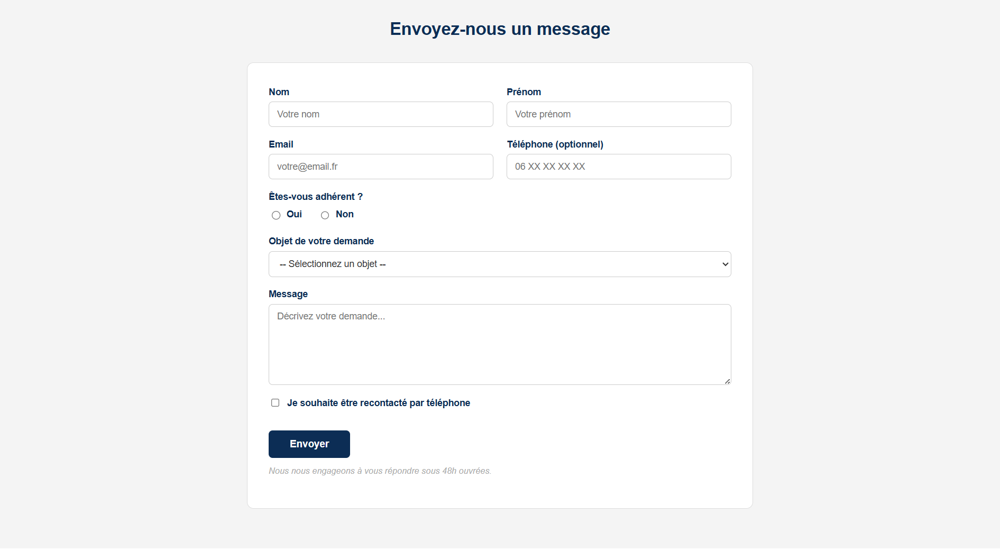

# 🌐 Site Web SMHT SIOtech — Projet Système d'Information

Site web vitrine avec formulaire de contact fonctionnel, réalisé dans le cadre 
d'un projet de mise en place d'un **système d'information** pour le Syndicat des 
Métiers de la Haute Technologie (SMHT).
Projet en BTS SIO pour le cours en Réseau
---

## 📌 Présentation du projet

Dans le cadre du projet BTS SIO, notre entreprise fictive **SIOtech** a été 
chargée de concevoir et déployer un système d'information complet pour le SMHT.

Notre mission : développer le **site web officiel** de l'organisation, incluant 
une page de contact permettant aux adhérents et visiteurs de soumettre une demande 
directement par mail.

---

## ✨ Fonctionnalités du site

1. Page vitrine de présentation du SMHT
- Formulaire de contact complet :
  - Nom, prénom, email, téléphone (optionnel)
  - Statut adhérent (Oui / Non)
  - Objet de la demande (liste déroulante)
  - Message libre
  - Option de rappel téléphonique
- **Envoi automatique des données par mail** à la réception
- Accessible en réseau local via l'adresse IP du serveur

2. Visite du site avec les informations etc

---

## 🛠️ Technologies utilisées

| Technologie | Utilisation |
|---|---|
| HTML | Structure des pages |
| CSS | Mise en forme et design |
| JavaScript | Validation et interactions |
| WAMP / XAMPP | Serveur local (Apache + PHP) |
| PHP | Traitement et envoi du formulaire par mail |

---

## 🚀 Déploiement en réseau local

Le site est hébergé sur une machine locale via **WAMP/XAMPP**.  

---

## 🖼️ Aperçu
 **Formulaire de contact**

---

## 👥 Auteurs

- **Evan** — [@evanqlf](https://github.com/evanqlf)
- **Mehdi** — Binôme de classe BTS SIO sur le projet

> Projet réalisé en binôme dans le cadre du **BTS SIO**  
> Contexte : Appel d'offre SMHT — Mise en place d'un système d'information
